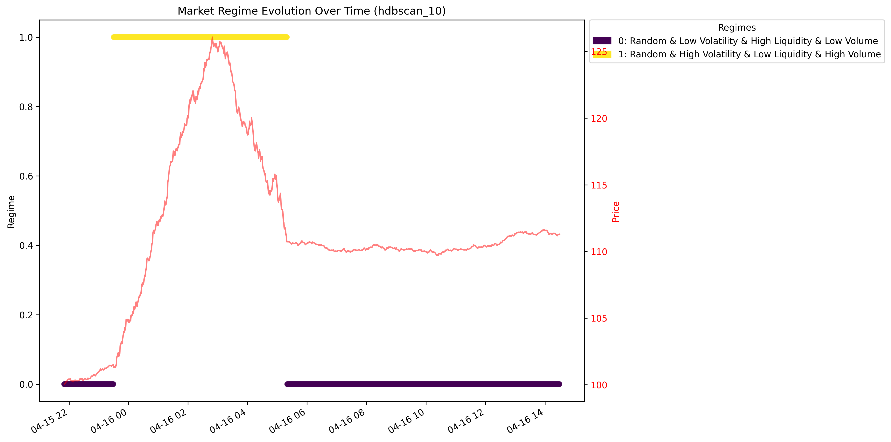
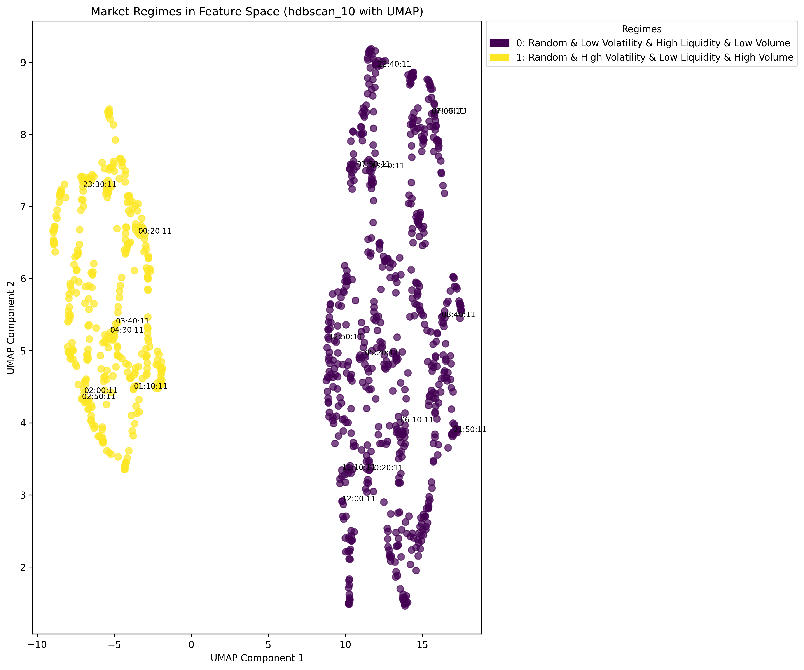
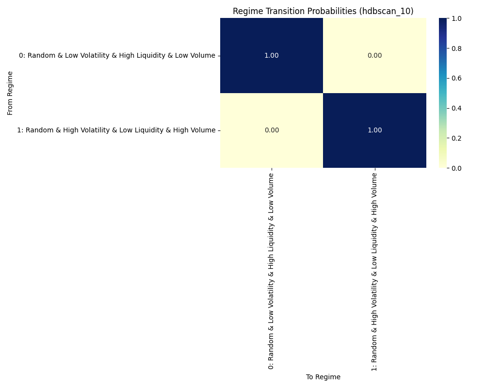

# Market Regime Detection Analysis Report

Generated on: 2025-04-20 21:50:26

## Executive Summary

This report presents the results of unsupervised market regime detection using clustering algorithms on market data. The analysis identified **2 distinct market regimes** with clear differences in volatility, trend behavior, and liquidity characteristics.

The dominant regime is **Random & Low Volatility & High Liquidity & Low Volume**, occurring in **65.0%** of the analyzed time period.

Key characteristics of the dominant regime:
- **Low volatility**
- **Random price behavior**
- **High liquidity**
- **Low volume**

## 1. Data Overview

- **Number of samples**: 1000
- **Number of features**: 21
- **Time period**: 2025-04-15 21:50:11.064081 to 2025-04-16 14:29:11.064081

### Feature Categories

**Price Features** (9):
- `ask_price_0`
- `bid_price_0`
- `mid_price`
- `momentum_10`
- `momentum_30`
- ... and 4 more

**Volatility Features** (4):
- `volatility`
- `volatility_10`
- `volatility_30`
- `volatility_60`

**Liquidity Features** (6):
- `ask_qty_0`
- `bid_qty_0`
- `cum_ask_qty`
- `cum_bid_qty`
- `depth`
- ... and 1 more

**Volume Features** (2):
- `volume`
- `volume_imbalance`

## 2. Clustering Model Evaluation

The best performing clustering model is **hdbscan_10** with a silhouette score of **0.5122**.

### Model Performance Comparison

| Model | # Clusters | Silhouette Score ↑ | Davies-Bouldin ↓ | Calinski-Harabasz ↑ |
|-------|------------|-------------------|-----------------|---------------------|
| hdbscan_10 | 2 | 0.5122 | 0.9177 | 1120.7891 |
| hdbscan_15 | 2 | 0.5122 | 0.9177 | 1120.7891 |
| kmeans_3 | 3 | 0.4978 | 1.1357 | 852.7663 |
| gmm_3_full | 3 | 0.4970 | 1.1402 | 850.9036 |
| gmm_3_diag | 3 | 0.4970 | 1.1402 | 850.9036 |

## 3. Regime Characteristics

### Regime Summary

| Regime | Name | Size | Volatility | Price Behavior | Liquidity | Volume |
|--------|------|------|------------|----------------|-----------|--------|
| 0 | Random & Low Volatility & High Liquidity & Low Volume | 65.0% | Low | Random | High | Low |
| 1 | Random & High Volatility & Low Liquidity & High Volume | 35.0% | High | Random | Low | High |

### Detailed Regime Descriptions

#### Regime 0: Random & Low Volatility & High Liquidity & Low Volume

- **Size**: 65.0% of the analyzed period
- **Volatility**: 0.0105
- **Autocorrelation**: 0.0127
- **Spread**: 0.0241
- **Depth**: 4136.8433
- **Volume**: 104.6333
- **Price Behavior**: Random
- **Volatility Type**: Low
- **Liquidity**: High
- **Direction Type**: Sideways
- **Volume Type**: Low

Selected average feature values:
- `volatility`: 0.0004
- `spread`: 0.0241
- `volume`: 104.6333
- `volume_imbalance`: -0.0121
- `price_zscore_10`: -0.0390

#### Regime 1: Random & High Volatility & Low Liquidity & High Volume

- **Size**: 35.0% of the analyzed period
- **Volatility**: 0.0557
- **Autocorrelation**: 0.1453
- **Spread**: 0.0390
- **Depth**: 1555.8536
- **Volume**: 224.9660
- **Price Behavior**: Random
- **Volatility Type**: High
- **Liquidity**: Low
- **Direction Type**: Sideways
- **Volume Type**: High

Selected average feature values:
- `volatility`: 0.0022
- `spread`: 0.0390
- `volume`: 224.9660
- `volume_imbalance`: 0.0392
- `price_zscore_10`: -0.0016

## 4. Regime Transitions

### Transition Probability Matrix

| From / To | 0: Random & Low Volatility & High Liquidity & Low Volume | 1: Random & High Volatility & Low Liquidity & High Volume |
|---|---|---|
| 0: Random & Low Volatility & High Liquidity & Low Volume | 1.00 | 0.00 |
| 1: Random & High Volatility & Low Liquidity & High Volume | 0.00 | 1.00 |

### Markov Chain Analysis

The market regime transitions exhibit Markovian properties, where the probability of transitioning to a new regime depends primarily on the current regime. Based on the transition matrix, we can observe:

1. On average, regimes have a **1.00 probability** of persisting from one time step to the next, indicating a degree of regime stability.

## 5. Visualizations

The following visualizations are available in the results directory:

### Regime Evolution

### Regime Distribution (UMAP)

### Transition Heatmap

### Feature Distributions

Multiple feature distribution plots are available showing how key features vary across regimes.

## 6. Trading Implications

Different market regimes require different trading strategies. Based on the identified regimes:

### Random & Low Volatility & High Liquidity & Low Volume

- Tighter stop-losses can be used due to lower volatility
- May require **larger position sizes** to achieve target returns
- Can execute larger orders with minimal market impact
- More suitable for **high-frequency strategies** due to lower transaction costs

### Random & High Volatility & Low Liquidity & High Volume

- **Wider stop-losses** may be needed due to high volatility
- Consider **volatility-based position sizing** to manage risk
- **Reduce position sizes** due to higher transaction costs
- Use **limit orders** instead of market orders to minimize slippage

## 7. Conclusion and Next Steps

This analysis has successfully identified distinct market regimes with characteristic behaviors in terms of volatility, trend, and liquidity. These regimes provide a foundation for developing adaptive trading strategies.

### Recommended Next Steps

1. **Regime Prediction Model**: Develop a model to predict regime shifts in advance
2. **Strategy Optimization**: Fine-tune trading strategies for each specific regime
3. **Extended Validation**: Validate regime detection across different market conditions and timeframes
4. **Feature Importance Analysis**: Identify which features are most significant in each regime
5. **Integrate with Execution Framework**: Deploy regime detection in a live trading environment

---

© Market Regime Detection Analysis | Generated on 2025-04-20 21:50:26
