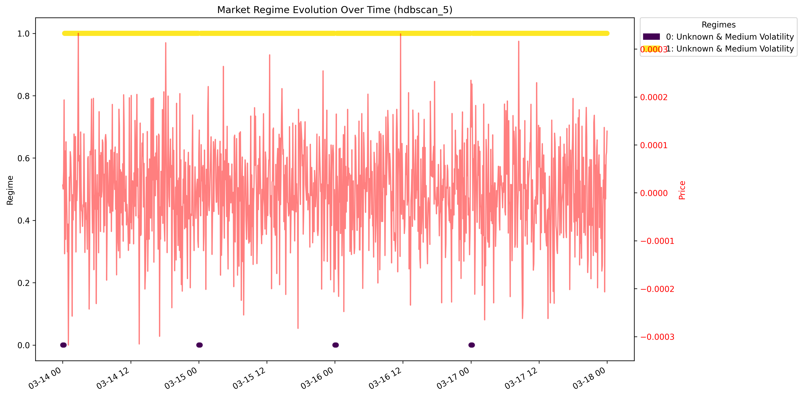
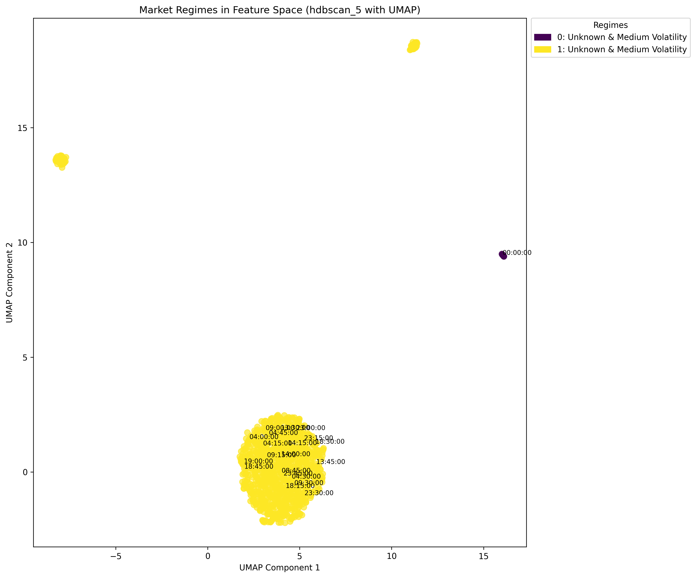
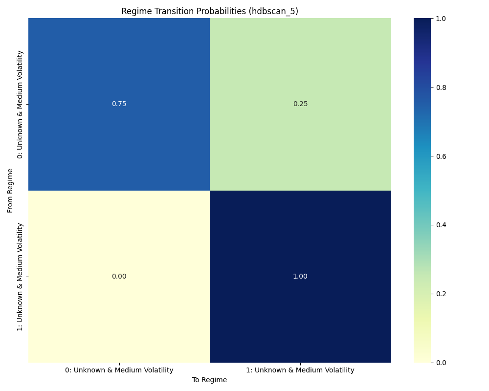

# Market Regime Detection Analysis Report

Generated on: 2025-04-20 23:12:35

## Executive Summary

This report presents the results of unsupervised market regime detection using clustering algorithms on market data. The analysis identified **2 distinct market regimes** with clear differences in volatility, trend behavior, and liquidity characteristics.

The dominant regime is **Unknown & Medium Volatility**, occurring in **98.6%** of the analyzed time period.

Key characteristics of the dominant regime:
- **Medium volatility**
- **Unknown price behavior**
- **Medium volume**

## 1. Data Overview

- **Number of samples**: 1153
- **Number of features**: 45
- **Time period**: 2025-03-14 00:00:00 to 2025-03-18 00:00:00

### Feature Categories

**Price Features** (13):
- `momentum_15`
- `momentum_30`
- `momentum_5`
- `price`
- `price_accel_15`
- ... and 8 more

**Volatility Features** (9):
- `buy_ratio_std_15`
- `buy_ratio_std_30`
- `buy_ratio_std_5`
- `rel_volatility_15`
- `rel_volatility_30`
- ... and 4 more

**Volume Features** (10):
- `rel_volume_15`
- `rel_volume_30`
- `rel_volume_5`
- `volume`
- `volume_ma_15`
- ... and 5 more

## 2. Clustering Model Evaluation

The best performing clustering model is **hdbscan_5** with a silhouette score of **0.8306**.

### Model Performance Comparison

| Model | # Clusters | Silhouette Score ↑ | Davies-Bouldin ↓ | Calinski-Harabasz ↑ |
|-------|------------|-------------------|-----------------|---------------------|
| hdbscan_5 | 2 | 0.8306 | 0.1504 | 374.0529 |
| hdbscan_10 | 2 | 0.8306 | 0.1504 | 374.0529 |
| gmm_3_diag | 3 | 0.0646 | 0.5760 | 1598.0339 |
| kmeans_3 | 3 | 0.0633 | 2.5790 | 1501.2292 |
| gmm_3_full | 3 | 0.0548 | 0.5792 | 1596.3740 |

## 3. Regime Characteristics

### Regime Summary

| Regime | Name | Size | Volatility | Price Behavior | Liquidity | Volume |
|--------|------|------|------------|----------------|-----------|--------|
| 0 | Unknown & Medium Volatility | 1.4% | Medium | Unknown | N/A | Medium |
| 1 | Unknown & Medium Volatility | 98.6% | Medium | Unknown | N/A | Medium |

### Detailed Regime Descriptions

#### Regime 0: Unknown & Medium Volatility

- **Size**: 1.4% of the analyzed period
- **Volatility**: 3333.3367
- **Volume**: 0.7000
- **Price Behavior**: Unknown
- **Volatility Type**: Medium
- **Direction Type**: Sideways
- **Volume Type**: Medium

Selected average feature values:
- `volume`: 1.0000
- `volatility_5`: 0.0000
- `rel_volatility_5`: 10000.0000
- `momentum_5`: -0.0000
- `price_zscore_5`: -0.0000

#### Regime 1: Unknown & Medium Volatility

- **Size**: 98.6% of the analyzed period
- **Volatility**: 3333.3335
- **Volume**: 0.7000
- **Price Behavior**: Unknown
- **Volatility Type**: Medium
- **Direction Type**: Sideways
- **Volume Type**: Medium

Selected average feature values:
- `volume`: 1.0000
- `volatility_5`: -0.0000
- `rel_volatility_5`: 10000.0000
- `momentum_5`: -0.0000
- `price_zscore_5`: 0.0000

## 4. Regime Transitions

### Transition Probability Matrix

| From / To | 0: Unknown & Medium Volatility | 1: Unknown & Medium Volatility |
|---|---|---|
| 0: Unknown & Medium Volatility | 0.75 | 0.25 |
| 1: Unknown & Medium Volatility | 0.00 | 1.00 |

### Markov Chain Analysis

The market regime transitions exhibit Markovian properties, where the probability of transitioning to a new regime depends primarily on the current regime. Based on the transition matrix, we can observe:

1. On average, regimes have a **0.87 probability** of persisting from one time step to the next, indicating a degree of regime stability.

2. The most likely regime transition is from **0: Unknown & Medium Volatility** to **1: Unknown & Medium Volatility** with a probability of **0.25**.

## 5. Visualizations

The following visualizations are available in the results directory:

### Regime Evolution

### Regime Distribution (UMAP)

### Transition Heatmap

### Feature Distributions

Multiple feature distribution plots are available showing how key features vary across regimes.

## 6. Trading Implications

Different market regimes require different trading strategies. Based on the identified regimes:

### Unknown & Medium Volatility

- Trading implications need to be determined based on specific strategy requirements

### Unknown & Medium Volatility

- Trading implications need to be determined based on specific strategy requirements

## 7. Conclusion and Next Steps

This analysis has successfully identified distinct market regimes with characteristic behaviors in terms of volatility, trend, and liquidity. These regimes provide a foundation for developing adaptive trading strategies.

### Recommended Next Steps

1. **Regime Prediction Model**: Develop a model to predict regime shifts in advance
2. **Strategy Optimization**: Fine-tune trading strategies for each specific regime
3. **Extended Validation**: Validate regime detection across different market conditions and timeframes
4. **Feature Importance Analysis**: Identify which features are most significant in each regime
5. **Integrate with Execution Framework**: Deploy regime detection in a live trading environment

---

© Market Regime Detection Analysis | Generated on 2025-04-20 23:12:35
